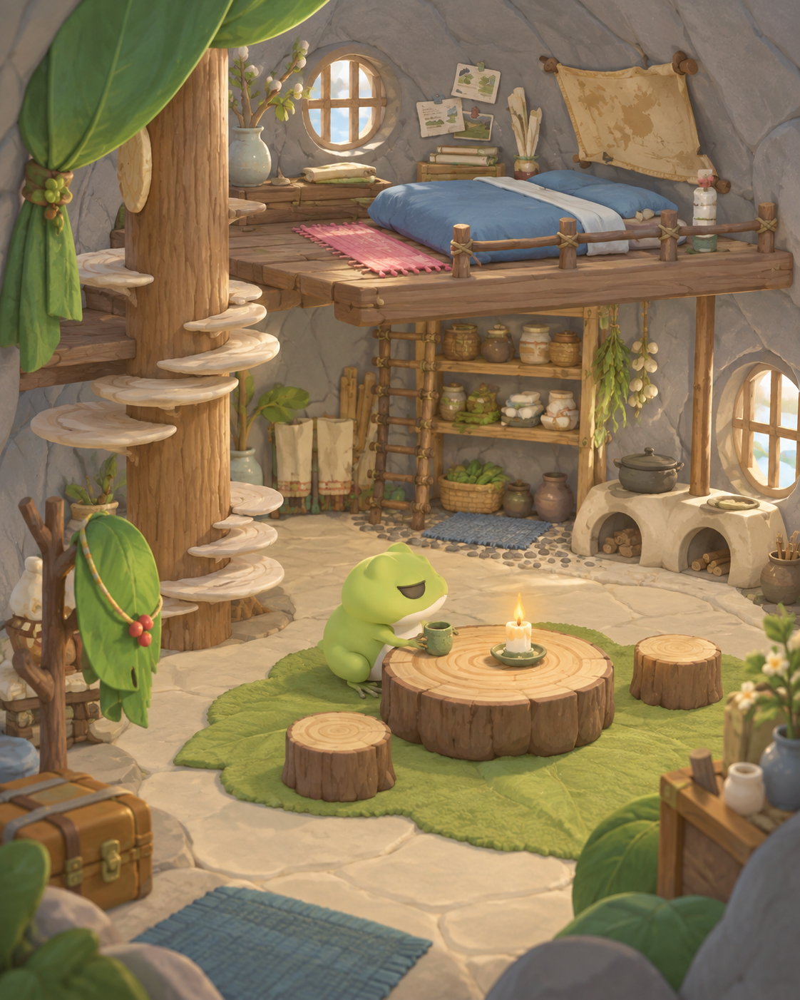
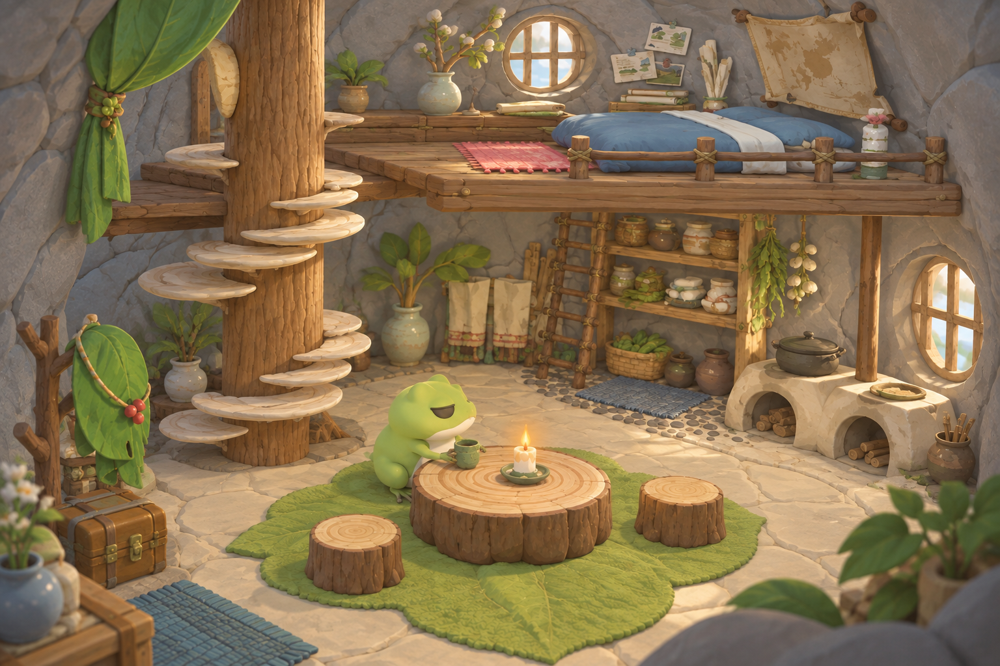
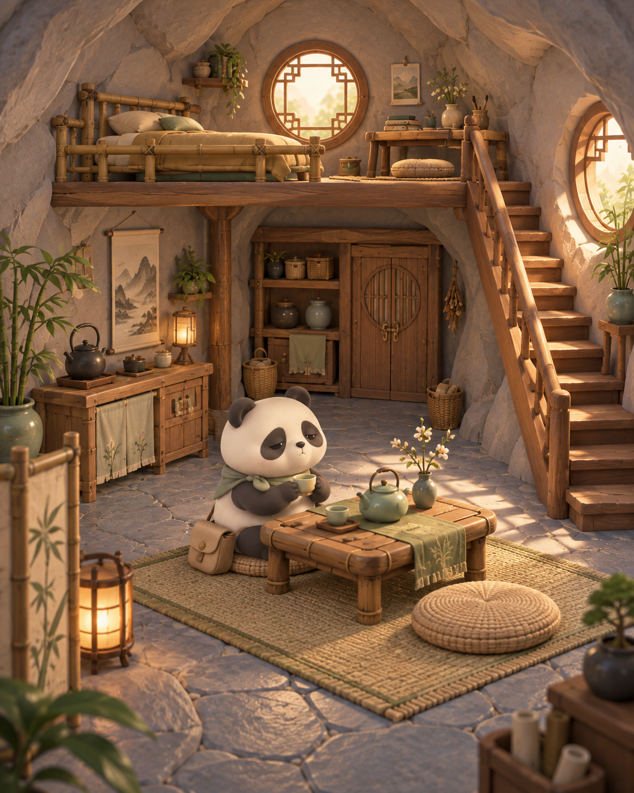

# 第二轮：青蛙家保留原装修，石屋另给熊猫

更新：2026-09-12。状态：本页保留获准制作的 AI 概念；两户住宅已经进入 Blender 与 Godot 实现。用户随后要求进一步还原石材、木材、织物细节与腿部动作。概念图片本身不作为游戏截图，实际实现与发布证据另行记录。

## 本轮用户纠正

青蛙家继续采用最新图 1、2 的装修语言。上轮生成的石屋可分给熊猫或松鼠，并增加中式气质。上轮蛙过小、房间过大，需要把比例收回中间档。

本轮先将那套石屋分给熊猫，分别呈现两户住宅。

## 青蛙家

以图 1 的树干、蘑菇台阶、蓝色睡铺、小圆桌为主要识别元素；图 2 补充叶子布艺、生活物件、灰色石壁和上下层温暖装修感。图 2 不作为整套布局覆盖图 1。

保留：
- 左侧树干与蘑菇台阶；后侧木夹层、睡铺、地图与书。
- 地面的圆木小桌、树桩凳、叶子或苔藓形地毯。
- 架子、陶罐、挂草与圆润双灶；门旁叶子衣架和旅行箱。
- 密闭天然灰色石壁，以及完整的室内感。

调整：
- 缩细与安排树干、楼梯，降低遮挡；不再把它们删掉。
- 蛙比上轮缩小后的概念明显一些，房间收紧，家具恢复合适的使用尺度。
- 当时以房宽 10–11 个蛙身高、深约 9、高约 6.2、夹层约 3 为概念目标。当前模型实际采用蛙高 1.08、房宽 11.2、深 9.8、顶高 6.6、夹层标高 3.25；上一版 15 × 12F 与 45% 空余地面的建议已撤回。
- 主视角中角色应清楚可见；画面占比会随相机改变，不能直接等同于房间物理比例。

## 熊猫家

继承上轮石屋的连续岩面、后侧夹层、右侧楼梯与茶区；用竹床、竹木茶桌、编织坐垫、花格圆窗、水墨小挂画和青瓷茶具体现中式生活气质。保持简洁温暖的动物住宅。

本轮把这套住宅分给熊猫，并已制作成独立 Blender 模型。松鼠和胖橘的住宅尚未设计，角色概念仍保留。

## 来源、限制与下一步

蛙模型来自 Tripo v3.1，骨骼和动作由 Blender 处理；房屋与家具继续使用 Blender。本页住宅与熊猫图片都是内置 imagegen 概念。后续熊猫模型也已通过 Tripo 制作，来源与任务编号见 [角色来源记录](../../../panda-asset-source.json)。

设计阶段优先检查装修归属、角色可读性与整体尺度。AI 不同视角仍会改变局部栏杆、物件和台阶，不能把上面的图片称为一致的建筑模型。现在已有同一真实模型的 [蛙家四视角](../../../evidence/frog-home/detail-pass/README.md) 与 [熊猫茶屋细节](../../../evidence/panda-home/details-02/README.md)，补充了岩面、碎边地板、木纹、布面、陶釉、编篮和厚圆窗。

可编辑源位于 `worlds/frog/blender/`：`frog-home-enclosure.blend`、`frog-home-furnishings.blend`、`frog-home-review.blend` 和 `panda-home.blend`。运行 GLB 已接入 Godot；本轮最终实机视觉验收与网页发布另行记录。

角色来源与原作资料沿用上一轮核查：[Hit-Point 官方页](https://www.hit-point.co.jp/games/tabikaeru/index.html)、[原作室内截图](https://www.4gamer.net/games/405/G040590/20171225138/screenshot.html?num=007)。此次三张上传参考的用途已经单独归档，不把来源未知的插画全部称为原作官方截图。

生成工具：内置 imagegen。完整提示词及参考角色说明见 [prompts.json](prompts.json)。最新复盘见 [3D 世界制作方法](../../../3d-world-method.md)。
