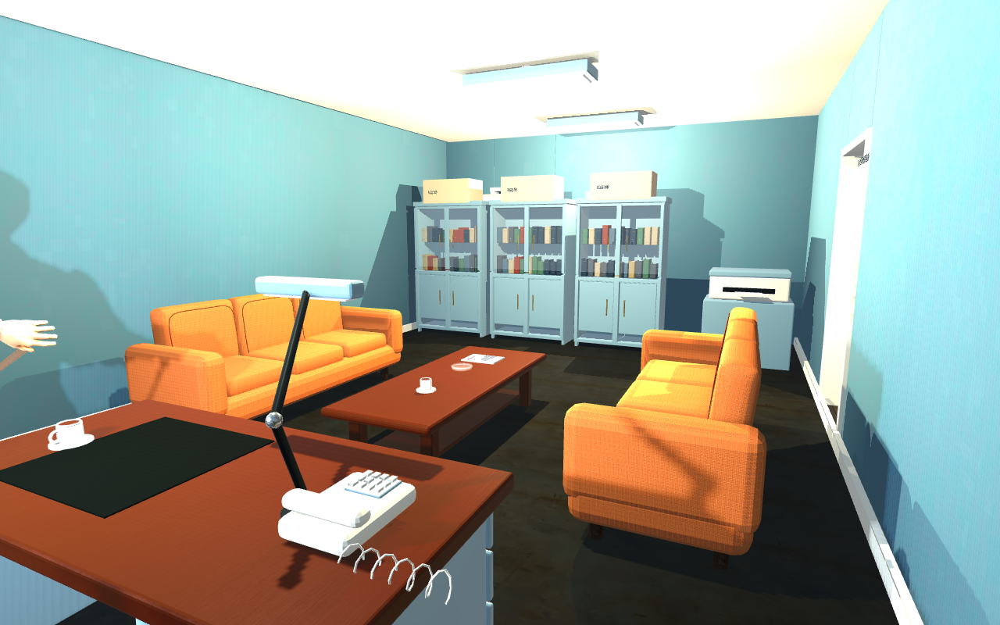
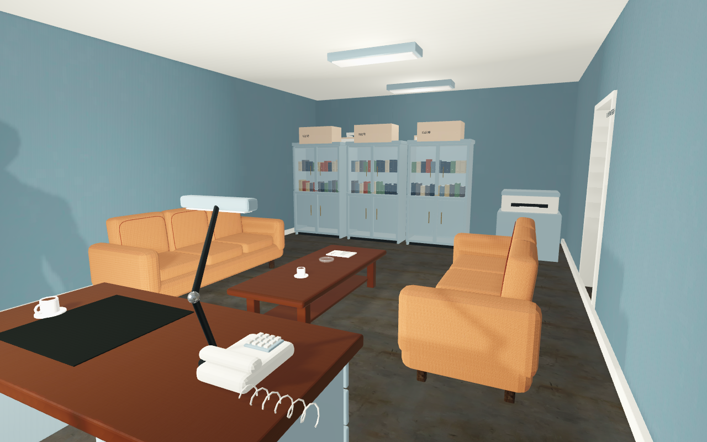
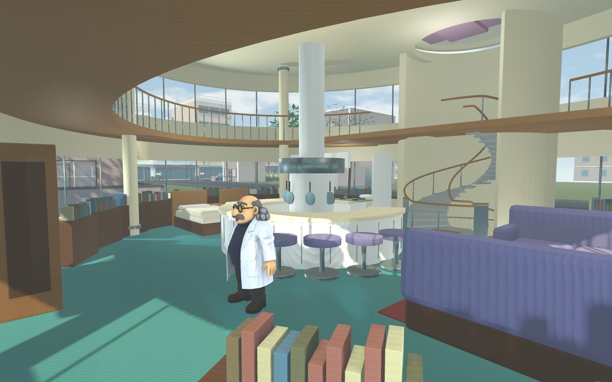
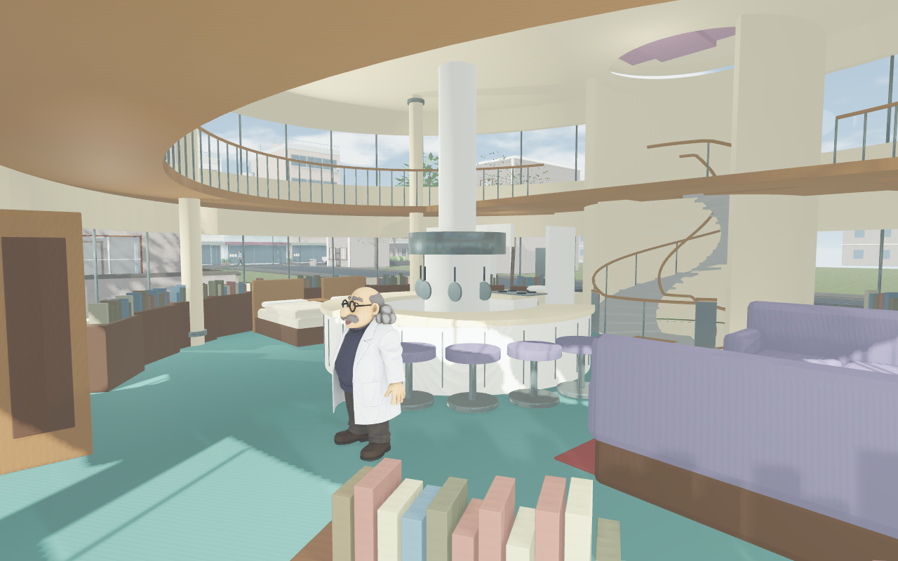

# 柯南世界柔和光照 · 2026-09-13

状态：实际 Godot 4.7.2 Compatibility 渲染截图。不是概念图，也不是图片后期调色。网页发布状态以 `release.json` 为准。

用户反馈：事务所肤色刺白、阴影黑重，墙面和家具配色过浓。固定事务所镜头分别拍摄修改前与修改后；角色默认姿势同时从空手 Read 调整到 Idle。角色蒙皮修正另有动作证据，不用此处静态图证明动画正确。

| 修改前 | 修改后 |
| --- | --- |
|  |  |
|  |  |

处理顺序是先光照、再材质、最后少量画面调色：重叠的顶灯降低为弱漫反射补光，窗光保留方向性和较淡投影，太阳继续完整遮光；中性环境光替代偏蓝阴影。灰色胶地板的乘色从 `777e7c` 改为 `bfc3bc`，保留原纹理。最终饱和度 0.84、对比度 0.96。日夜均在 `update_life()` 维护，避免下一帧恢复旧光。

近白像素（RGB 三通道均大于245）从14.47%降到0.27%；事务所同一地板区域的平均亮度从0.122升到0.283，整体亮度标准差从0.298降到0.219。统计采用8位画面的BT.601亮度，只说明该镜头的黑白反差变化，不能当作所有场景的曝光质量评分。原数据见 `pixel-comparison.json`。

重现：用 `tools/capture-conan-soft-lighting.gd` 对安装了资产的 `worlds/conan/web-project` 运行真实 Compatibility 渲染，传入输出目录。脚本不覆盖生产光照参数，仅固定相机和昼夜。完整22张场景记录见 `capture-report.json`；本目录保留有代表性的昼夜图。工藤书房、博士家夜景均能辨认行走区域和家具结构。日间博士家更浅，保留了柱子、环廊和楼梯的边界。

## 这轮排查的边界

- 不能根据旧版文档断言 Environment 调色在当前 Compatibility 无效。实际做过饱和度0/1对照，4.7.2确实变成灰度；最终使用轻量调色。
- 不降低太阳阴影不透明度来“抬亮室内”：这会减弱屋顶遮光。最终太阳仍正常投影，仅窗灯投影减淡。
- 本轮关闭投影的是已经降低能量的重叠顶灯，作为有限范围补光；不修改模型的投影能力，不推广为所有室内灯都关闭阴影。
- 这是桌面运行的网页同类渲染器；真正导出包的网页加载与触控需单独验收。

## 最终网页包验收

实际WebGL三户导航、正式手机菜单昼夜切换、视角/互动操作4项通过；390×844与844×390、多指移动/视角/跑步与松手释放4项通过，无脚本错误。见 `web-preview/report.json` 和 `web-touch/report.json`。首次测试键盘焦点未进入画布，夜景并未切换；已改为点击正式手机“昼夜”菜单，重新核对21:00画面。最终包校验见 `final-web-pack.json`。

Kogoro保留4K内嵌纹理，包下载体积172,709,882字节。3张不再引用的旧外置图只在导出时排除，源文件保留；模型及文本引用扫描通过才启用此排除。新包比旧版约多20MB，是本轮贴图内嵌与修正后的运行资产代价，未声称加载体积减少。
