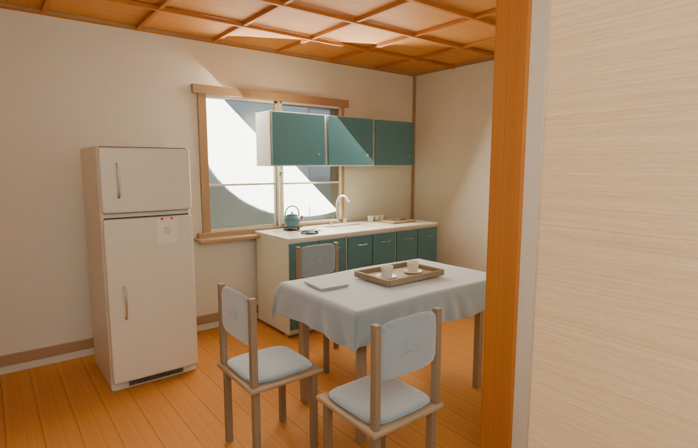
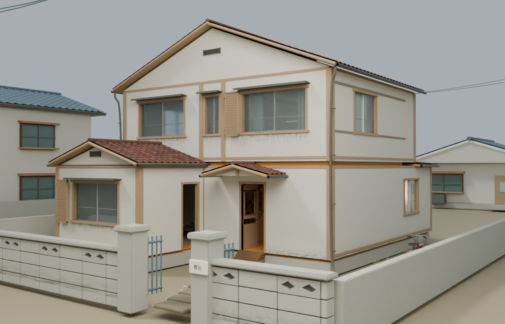

# 找回重建前的野比家

用户要求保留首页原有三个封面，并寻找截图中较早的野比家：青灰色吊柜、餐桌布和椅面，木框白墙，以及带菱形镂空的院墙。

## 找到的版本

- 原运行资源版本：`20260907-video10-final`，简称 v10。
- 已发布源码快照：[`bafe7f3`](https://github.com/frankfanyiming/frank_worlds/commit/bafe7f3fa6f9aa63a9e02a3729c77432335ef885)。模型与本地保留文件逐字节一致，11 份模型、布局和运行参考文件的长度及 SHA-256 见 [恢复清单](recovery-manifest.json)。
- 后续变化：[`4732f81`](https://github.com/frankfanyiming/frank_worlds/commit/4732f812200b421f9984e36079602a2f14be78d9) 重建街区。迁移脚本从 `world-v3` 移除了 `home_`/`facade_` 节点；`house-v10` 只留下 `v9_garden`，一楼家具等也不再出现在新加载清单中。由此改变了用户喜欢的房屋细节。

当前已恢复独立原文件副本和从 GLB 导入的 Blender 可编辑备份。它保留原几何、UV 与嵌入材质，是网格级编辑文件，并非重新获得已丢失的参数化建模历史。未修改或发布游戏房屋，没有回退第 23/24 版手机分档、加载与触控修复。

## 模型对照图

下图是原 GLB 在 Blender 中的核对渲染，使用独立日光。没有加载原游戏人物、全部绿植和天气后处理；光照与截图不同，不作为网页实机或性能验收。

吊柜位于窗前；左侧冰箱、下方灶台与水槽、餐桌布、茶盘双杯及椅背与用户截图对应。

两层体量、前侧低屋顶、木框与百叶、入口雨棚、院墙菱形孔和门柱与用户截图对应。

## 复现与后续接回方式

运行 `python3 tools/recover-doraemon-house-v10.py --out /path/to/separate-folder` 可以从 Git 提取原文件。工具不会替换运行资源；遇到已经改过的同名恢复文件会停止，避免覆盖。

如将旧房屋接回当前游戏，应保留最新控制器和移动端分档，在独立模型层整合原外观、一楼家具及布局合同，再验证新老门口、楼梯、房间可见性、NPC 坐标和手机资源预算。不能直接把完整源码回退到旧提交。
