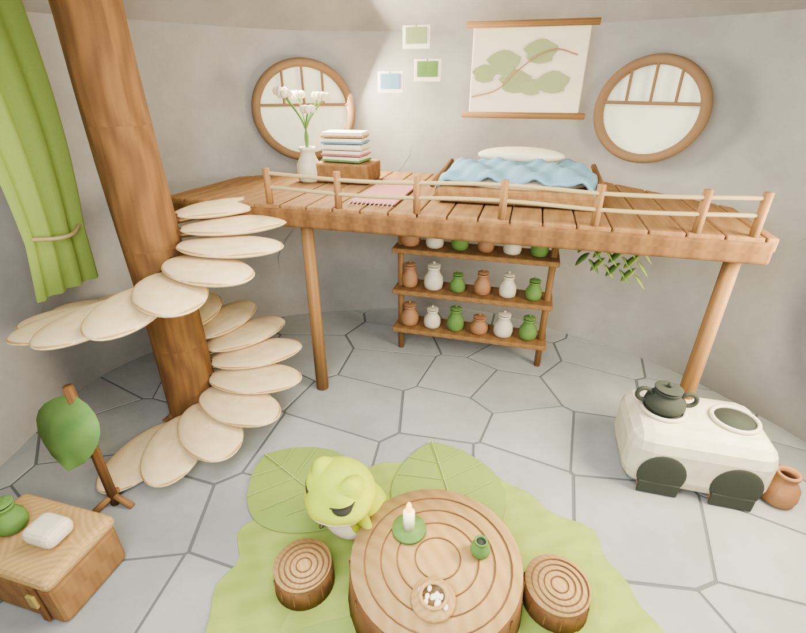

# 青蛙家同模型三视角

2026-09-12。**这三张是 Blender 同一模型的审查渲染，不是 Godot 实机截图，也不是网页上线证据。** 围护、家具和角色位置固定，改变的是相机；未使用 AI 生成不同角度。

场景保留左侧树干、蘑菇台阶、后夹层蓝色睡铺、圆木桌凳、叶毯、叶帘、陶罐与双灶。角色采用未修改的正式 Tripo 蛙 GLB。房间名义宽 11.2、深 9.8、顶高 6.6；角色高 1.08，夹层顶 3.25。

| 图片 | 审查内容 |
|---|---|
| [主视角](01-main.png) | 原作识别元素、木石对比、角色与家具比例 |
| [夹层](02-loft.png) | 被面与床垫分离、地图无黑片、楼梯接入与平台 |
| [入口](03-entry.png) | 密闭室内围护、桌区及楼梯的整体空间关系 |

已在 Blender 图中检查石板被底衬遮挡、床垫穿被、地图与平台共面黑片的修复。角色实际上下楼、动态相机、昼夜照明与网页加载，须查主任务的 Godot/发布证据；不能用本组图替代。

模型与相机的可编辑源在 `worlds/frog/blender/frog-home-review.blend`；模型不因本组截图而修改。渲染复制来源与 SHA-256 在 [manifest.json](manifest.json)。复用方法见 [住宅建模方法](../../household-production-method.md)。
