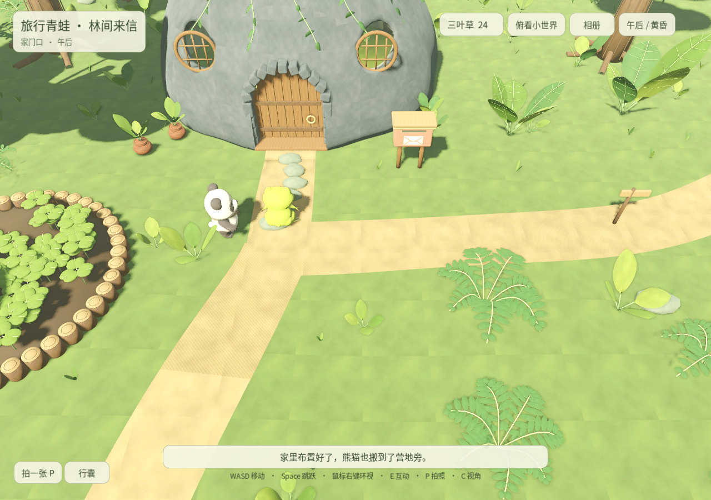
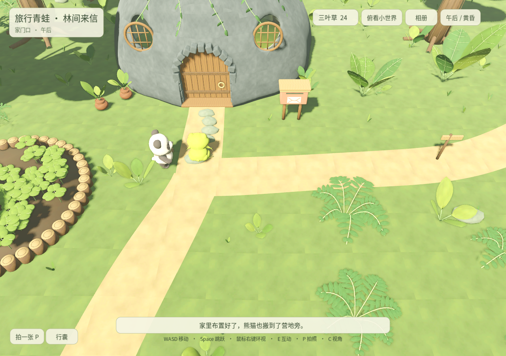
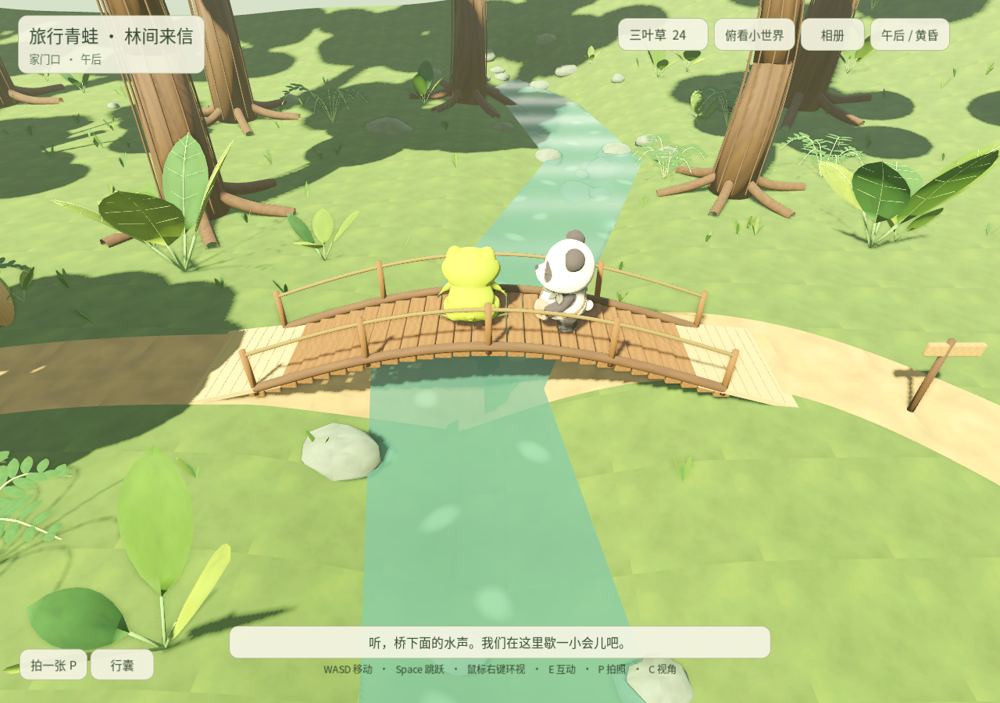
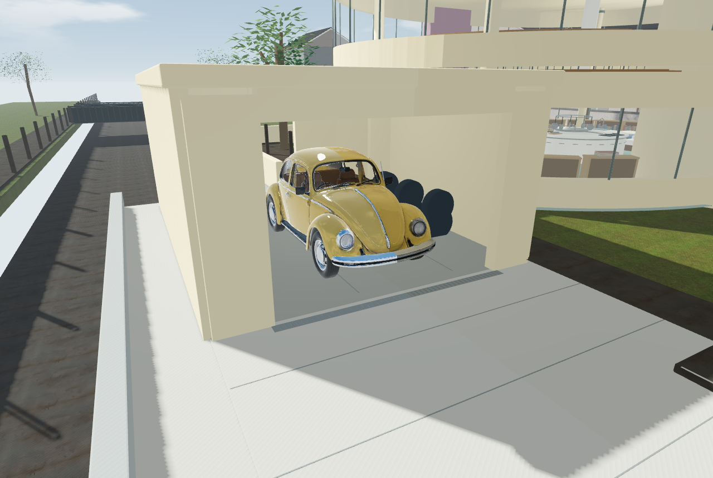
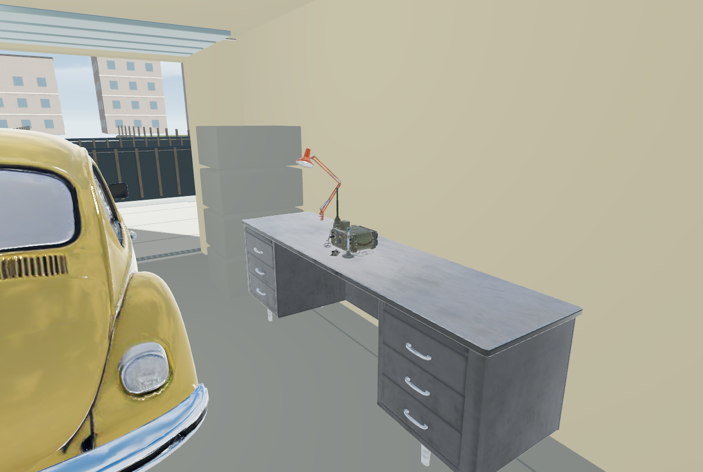
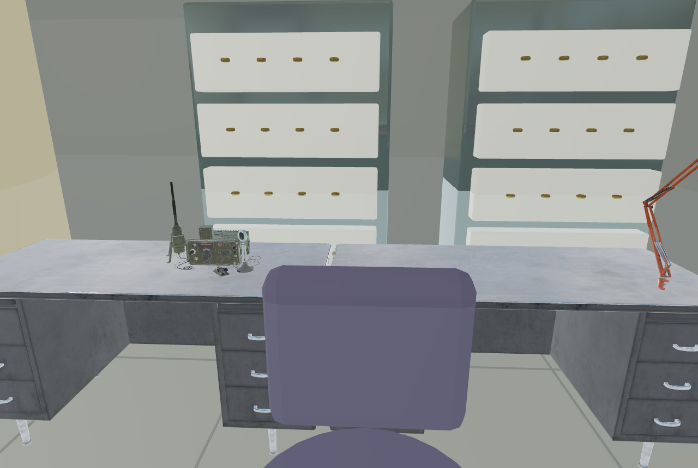
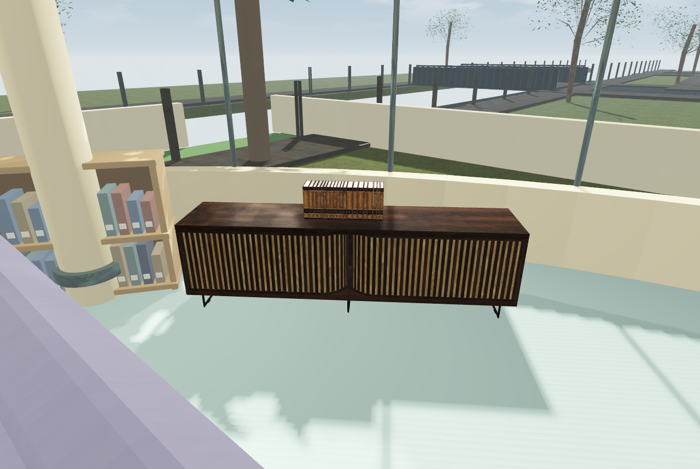
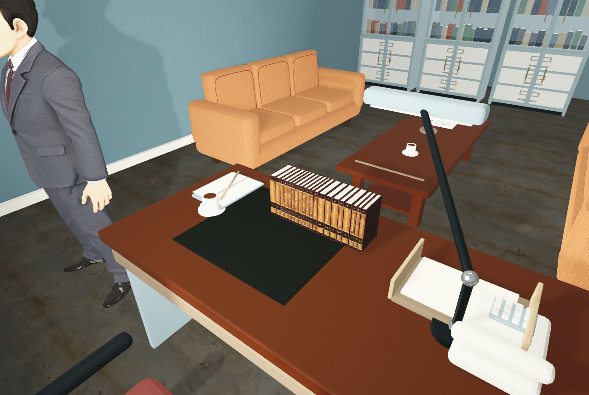
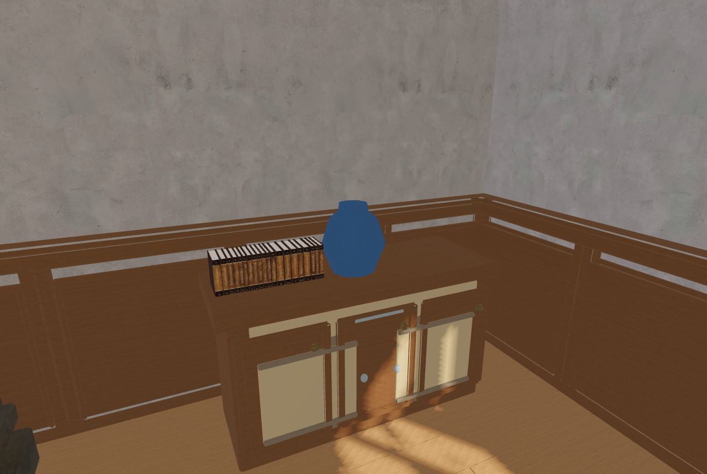

# 第 22 轮：路面、跟随、建筑接地与开放家具

2026-09-13。本目录区分定位过程、最终原生实机检查和网页检查；在线版本另以 `release.json` 的版本与运行包摘要核对。

## 已修正的原因

- 路面薄层面向下，双面材质掩盖错误，太阳阴影造成整段矩形色带。主路 1230 面、支路 192 面翻正并修正法线；仅薄路面不再自身投影。
- 伙伴导航范围漏掉熊猫家外的小路，旧脚印和固定慢速使其掉队。现在使用身体宽度的通道检查、及时目标更新和按距离追赶；桥边台词不再强制停三秒。新增实测贴合地形的桥头，保留桥和角色碰撞。
- 毛利入口原有 42cm 高碰撞墙横跨楼梯间，现为高出人行道约 25mm 的门槛。
- 博士家车库覆盖旧河床，门外曾落到 -1.55m。现在补齐有厚度的场地地基、挡墙、排水沟与同标高车道，并清掉此地块内的旧岸边栏杆。车轮最低点距地面约 1.2mm。
- 五组 CC0 家具已按用途放入场景，见 [来源与重建说明](../../conan-open-furniture.md)。

## 最终验证

| 检查 | 结果 | 证据 |
| --- | --- | --- |
| 毛利楼 + 博士住宅真实步行 | 51 项通过，342 段；街道进入、完整上下楼、地下室、车库进出 | [路线报告](conan-physical-routes-final/physical-routes.json) |
| 青蛙与熊猫连续步行、跑步、过桥 | 6 项通过；最大间距 1.976m；未观察到青蛙移动而熊猫原地停止 | [连续跟随](frog-follow-bridge-fixed/route.json) |
| 朋友日常机制回归 | 34 项通过，包括串门、两份料理、送礼、野餐、双人照片及刷新恢复 | [实机记录](frog-friends-runtime/runtime.json) |
| 网页存档与恢复 | 14 项通过，包括即时刷新、旧备份及容量不足回退 | [隔离浏览器记录](web-persistence/report.json) |
| 手机横竖屏与触控 | 两个原生世界 390×844、844×390；摇杆/转视角/跑步同时操作可释放 | [青蛙](mobile-frog/report.json)、[柯南](mobile-conan/report.json) |
| 三个世界完整网页 | 实际 WebGL 场景加载；菜单和朋友入口可见；运行包摘要匹配 | [本地组合页面](local-browser/browser-report.json) |

手机结果来自桌面 Chrome 的触屏及视口模拟，未声称是在实体手机测得。定位过程中的失败记录保留在其他目录，不作为最终通过证据。

## 公开发布核对

第 22 版已发布至 [GitHub Pages](https://frankfanyiming.github.io/frank_worlds/?v=22#world/frog)。运行代码提交为 `4ff3f692951958c42cb265087fc666f2c271f8fa`，已推送至 `main` 和 `feat/xlands-worlds-community`；网页提交为 `1261db919addf86c40bf06353db2b0b1d1743f28`。[发布工作流 34742958091](https://github.com/frankfanyiming/frank_worlds/actions/runs/34742958091) 的构建与部署均成功。

- [公开文件核对](public-browser/release22-public-integrity.json)：8 个页面、脚本和清单的 SHA-256 与发布文件一致；28 个运行包分块均可访问且大小一致。
- [公开浏览器报告](public-browser/browser-report.json)：三个世界均实际加载，青蛙和柯南运行包摘要与最终验收包相同，没有页面脚本异常；390×844 和 844×390 视口下的菜单、朋友入口与哆啦 A 梦口袋均检查通过。
- [青蛙公开手机版画面](public-browser/frog-390.png)、[柯南公开手机版画面](public-browser/conan-390.png)来自已发布页面的 Chrome WebGL 实际加载。

后续仅补充本报告和制作经验的文档提交不改变 `release.json` 中对应运行代码的 `sourceCommit`。

## 实机画面

这些是 Godot Compatibility 实机截图；没有使用概念图替代结果。柯南、毛利、博士角色文件与本轮之前的版本摘要一致，见 [模型与代码摘要](asset-manifest.json)。
